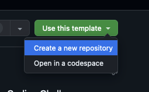

# GHG Emissions Prediction Challenge

## Getting Started

Welcome to the GHG Emissions Prediction Challenge! In this challenge, you will be tasked with predicting **Scope 1** greenhouse gas (GHG) emissions for companies based on financial and operational data. This challenge aims to assess your data analysis, modeling skills, and ability to extract meaningful insights.

---

### Clone This Repo

Start by cloning this repository using the **"Use this template"** button at the top right to create a new **private** repository:

In the settings of your new private repository, invite the following collaborators:

- `tomwhale`
- `MAlGIaT`

---

### Prerequisites

- **Python Version Management**: [Pyenv](https://github.com/pyenv/pyenv) (recommended) or any other tool of your choice.
- **Dependency Management**: [Poetry](https://python-poetry.org/) for managing project dependencies.

---

### Instructions

- Use the dataset provided in the `data` folder to develop a predictive model for **Scope 1** GHG emissions.

- **Note**: Do not use previous years' emissions data as input features when predicting current emissions.

- Document your methodology, analysis, and findings in a well-structured report.

- Include your code and any relevant visualizations in your submission.

- Use any Python version and libraries you prefer.

- Manage dependencies with **Poetry** and commit the `poetry.lock` file.

---

### Submission Guidelines

- **Deliverables**:
  - **Written Report**: Summarize your approach, analysis, and key findings.
  - **Code Files or Notebooks**: Include all code used in your analysis.
  - **Instructions**: Provide clear instructions on how to run your code and reproduce your results.

- **Repository Setup**:
  - Ensure your repository is **private** and that `tomwhale` and `MAlGIaT` have been added as collaborators.
  - Commit all your code, notebooks, and reports to the repository.
  - Include a clear `README.md` in your repository detailing how to set up the environment and run your code.

---

### Final Notes

- While model performance is important, we are especially interested in your **process**, **analytical thinking**, and ability to derive **insights** from the data.
- Good luck, and we look forward to reviewing your submission!
